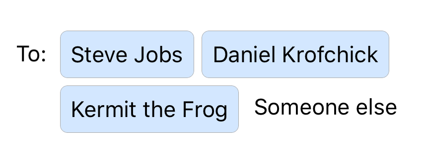

# FOTokenText

A UITextView and UITextField that supports token buttons, like those found in Mail. The tokens can be tappend on like buttons, and deleted.

Initialize an FOTextView
```swift
let textView = FOTokenTextView(frame: CGRect.zero)
textView.tokenDelegate = self
```
and implement the required `FOTokenTextViewProtocol` method `newToken:textView:text`
```swift
func newToken(_ textView: FOTokenTextView, text: String) -> FOTokenView {
  let token = FOTokenView(type: .system)
  token.setTitle(text, for: .normal)
  token.titleLabel?.font = textView.font

  return token
}
```


## Example

Try the example project in the `FOTokenText_Example` target.

## Installation

FOTokenText is available through [CocoaPods](http://cocoapods.org). To install
it, simply add the following line to your Podfile:

```ruby
pod 'FOPopup', :git => 'https://github.com/DanielKrofchick/FOTokenText.git'
```

## Author

Daniel Krofchick, krofchick@gmail.com

## License

FOTokenText is available under the MIT license. See the LICENSE file for more info.
